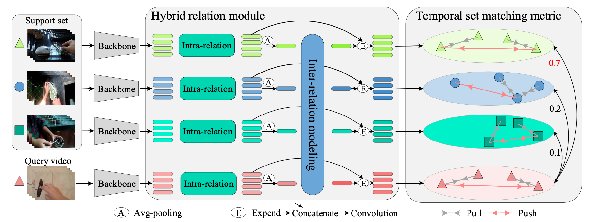

# HyRSM++: Hybrid Relation Guided Temporal Set Matching for Few-shot Action Recognition
### Official Pytorch Implementation of HyRSM++


> **HyRSM++: Hybrid Relation Guided Temporal Set Matching for Few-shot Action Recognition**<br>
> Xiang Wang,  Shiwei Zhang,  Zhiwu Qing, Zhengrong Zuo,  Changxin Gao,  Rong Jin, and Nong Sang
>
<!-- > [Paper](https://openaccess.thecvf.com/content/CVPR2022/papers/Wang_Hybrid_Relation_Guided_Set_Matching_for_Few-Shot_Action_Recognition_CVPR_2022_paper.pdf), [Project](https://hyrsm-cvpr2022.github.io/) -->
>
> **Abstract:** *Few-shot action recognition is a challenging but practical problem, which aims to learn a model that can be easily adapted to identify new action categories with only a few labeled samples. Recent attempts mainly focus on learning deep representations for each video individually under the episodic meta-learning regime and then performing temporal alignment to match query and support videos. However, they still suffer from two drawbacks: (i) learning individual features without considering the entire task may result in limited representation capability, and (ii) existing alignment strategies are sensitive to noises and misaligned instances. To handle the two limitations, we propose a novel Hybrid Relation guided temporal Set Matching (HyRSM++) approach for few-shot action recognition. The core idea of HyRSM++ is to integrate all videos within the task to learn discriminative representations and involve robust matching technique. To be specific, HyRSM++ consists of two key components, hybrid relation module and temporal set matching metric. Given the basic representations after feature extractor, the hybrid relation module is introduced to fully exploit associated relations within and cross videos in an episodic task and thus learn task-specific embeddings. Subsequently, in the temporal set matching metric, we carry out the distance measure between query and support videos from a set matching perspective and design a bidirectional Mean Hausdorff Metric to improve the resilience to misaligned instances. In addition, we explicitly exploit the temporal coherence in videos to regularize the matching process. In this way, HyRSM++ facilitates informative correlation exchanged among videos and enables flexible predictions under the data-limited scenario. Furthermore, we extend the proposed HyRSM++ to deal with the more challenging semi-supervised few-shot action recognition and unsupervised few-shot action recognition tasks. Experimental results on multiple benchmarks demonstrate that our HyRSM++ consistently outperforms existing methods and achieves state-of-the-art performance under various few-shot settings.*


This code is based on [pytorch-video-understanding](https://github.com/alibaba-mmai-research/TAdaConv) codebase, which provides a comprehensive video understanding solution for video classification and temporal detection. 

## Installation

Requirements:
- Python>=3.6
- torch>=1.5
- torchvision (version corresponding with torch)
- simplejson==3.11.1
- decord>=0.6.0
- pyyaml
- einops
- oss2
- psutil
- tqdm
- pandas

optional requirements
- fvcore (for flops calculation)

Or you can create environments with the following command:
```
conda env create -f environment.yaml
```

## Data preparation

First, you need to download the datasets from their original source (If you have already downloaded, please ignore this step
):

- [SSV2](https://20bn.com/datasets/something-something#download)
- [Kinetics](https://github.com/Showmax/kinetics-downloader)
- [UCF101](https://www.crcv.ucf.edu/data/UCF101.php)
- [HMDB51](https://serre-lab.clps.brown.edu/resource/hmdb-a-large-human-motion-database/#Downloads)
- [Epic-kitchens](https://epic-kitchens.github.io/2022)

Then, prepare data according to the [splits](configs/projects/hyrsmplusplus) we provide.

## Running
The entry file for all the runs are `runs/run.py`. 

Before running, some settings need to be configured in the config file. 
The codebase is designed to be experiment friendly for rapid development of new models and representation learning approaches, in that the config files are designed in a hierarchical way.

For an example run, open `configs/projects/hyrsmplusplus/kinetics100/HyRSMplusplus_K100_1shot_v1.yaml`

A. Set `DATA.DATA_ROOT_DIR` and `DATA.DATA_ANNO_DIR` to point to the kinetics dataset, 

B. Set the valid gpu number `NUM_GPUS`

Then the codebase can be run by:
```
python runs/run.py --cfg configs/projects/hyrsmplusplus/kinetics100/HyRSMplusplus_K100_1shot_v1.yaml
```

## Citation
If you find this code useful, please cite our paper.

~~~~
@inproceedings{wang2022hybrid,
  title={Hybrid Relation Guided Set Matching for Few-shot Action Recognition},
  author={Wang, Xiang and Zhang, Shiwei and Qing, Zhiwu and Tang, Mingqian and Zuo, Zhengrong and Gao, Changxin and Jin, Rong and Sang, Nong},
  booktitle={Proceedings of the IEEE/CVF Conference on Computer Vision and Pattern Recognition},
  pages={19948--19957},
  year={2022}
}
~~~~
